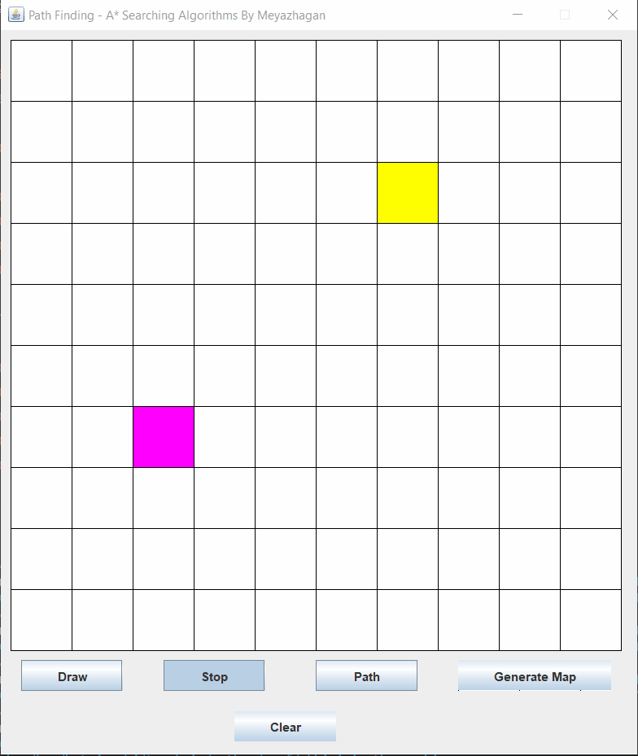
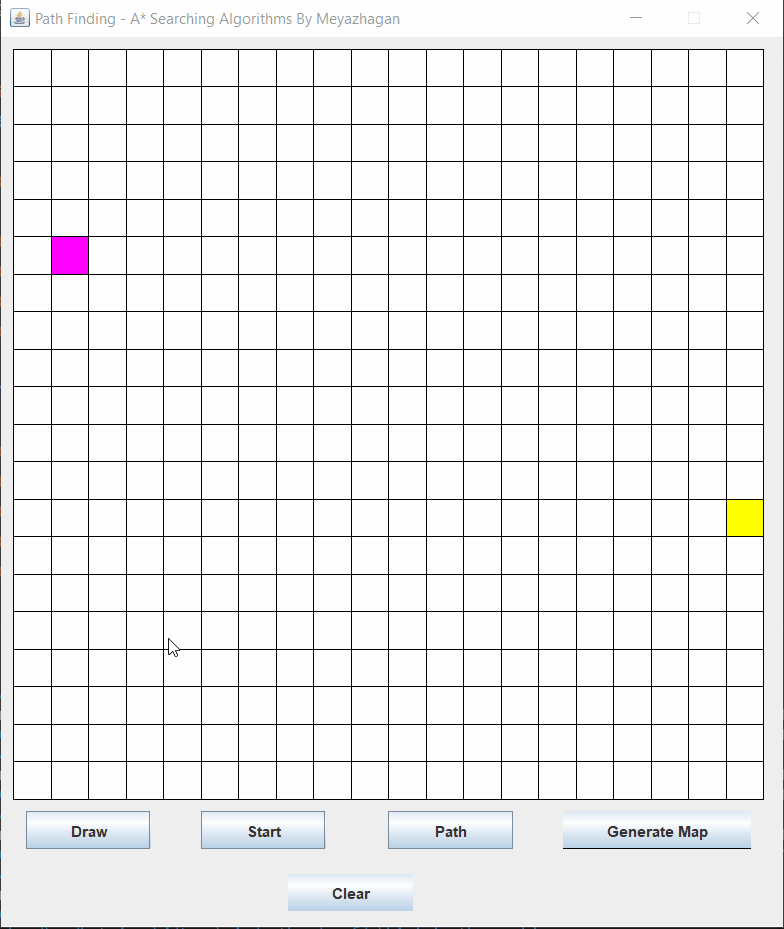
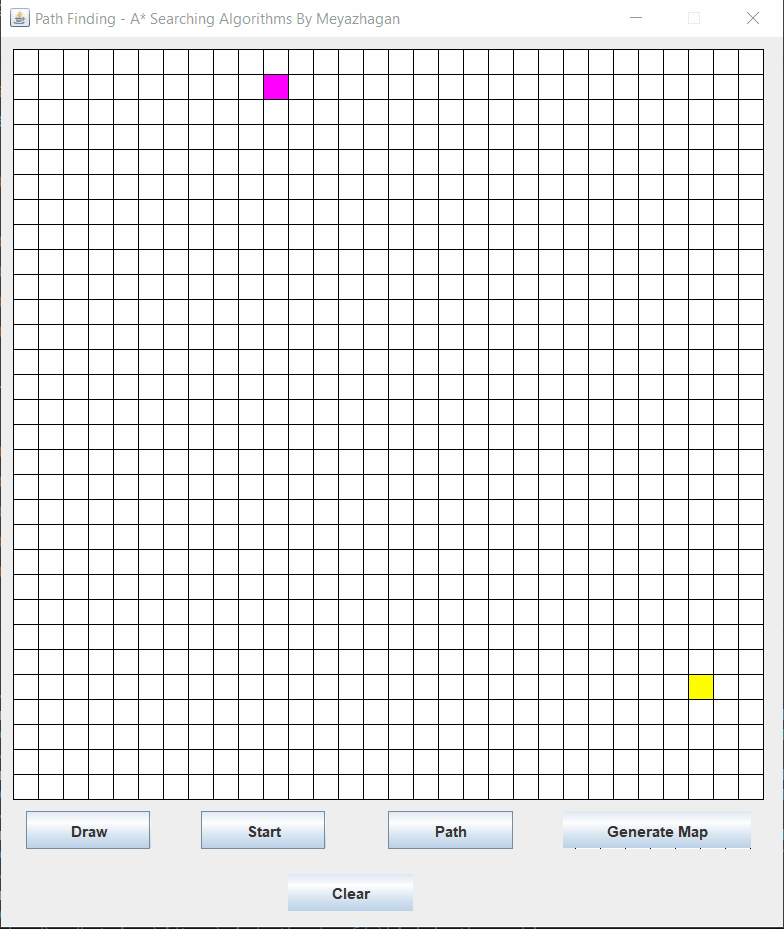
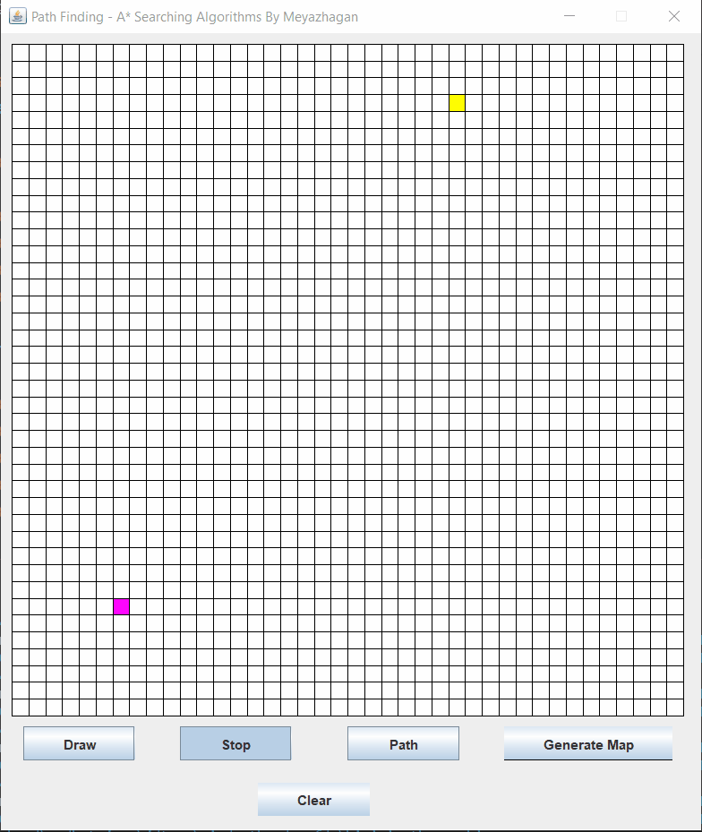

# FindPath
 Finding Shortest path using A* Searching algorithms
 
 ---
 
 ## Placing Start and Target
 
 
 ## Drawing and Erasing of wall
 
 
 ## Generating Maps
 
 
 ## Searching Path
 
 
 ---
 
 # LICENSE
 Licensed under [MIT License](LICENSE).
